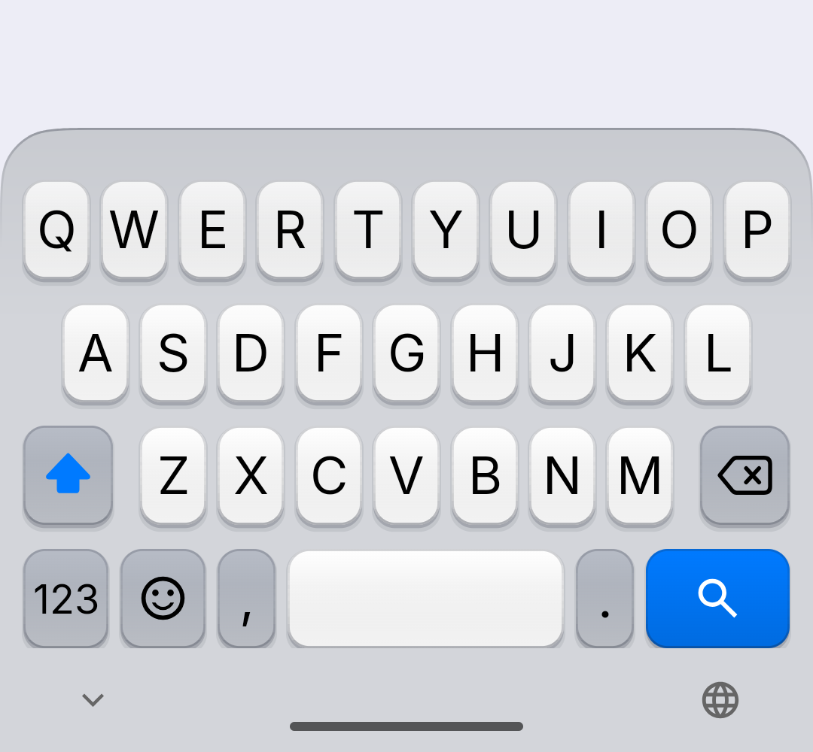
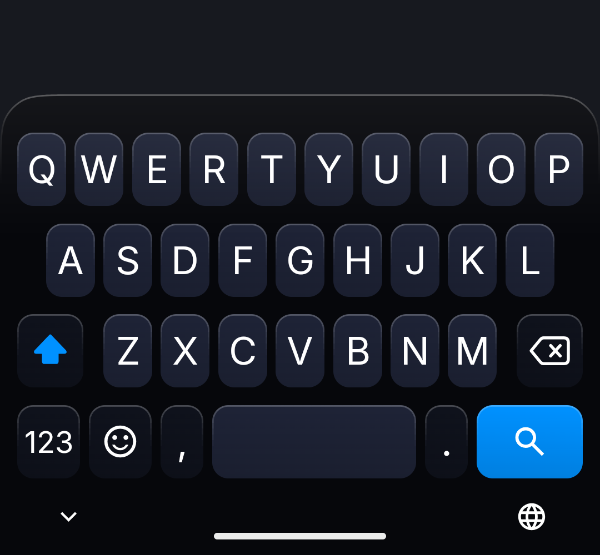

# Perfect Key

Perfect Key is a customizable, offline, open-source keyboard for Android with a minimal, clean look.
It does not use the internet permission, so it is 100% offline.

<p align="center">
  
  
</p>

## Features

- Clean, rounded keys with soft lighting and a compact key preview
- Dark and light themes with a near-black blue palette
- Phone-number pad for number fields
- Inline emoji search with keywords in English, Italian and Spanish
- Strong, crisp haptic feedback (uses the vibration primitives of the phone)
- Autocorrect and suggestions tuned for natural typing, offline dictionaries
- Optional SMS code pill: a verification code from a new text message appears above the keyboard, tap it to type it (off by default; needs the SMS receive permission, messages are read on arrival only and nothing is stored)
- Large, forgiving touch areas, including at the screen edges
- Customizable layouts (see [layouts.md](layouts.md)), themes, popup keys and toolbar
- Gesture typing (when a gesture library is installed), clipboard history, one-handed and split modes

## Building

```
./gradlew assembleRelease
```

The APK is written to `app/build/outputs/apk/release/`. You need the Android SDK (see `local.properties`) and a JDK.
The release APK is signed with the key named in `~/.android/perfectkey-release.properties` (`storeFile`, `storePassword`, `keyAlias`, `keyPassword`);
without that file the build produces an unsigned APK.

## License

Perfect Key is licensed under the [GNU General Public License v3.0](LICENSE).
It contains code under the Apache License 2.0 ([LICENSE-Apache-2.0](LICENSE-Apache-2.0)) and data under other licenses
([LICENSE-AGPL-3.0](LICENSE-AGPL-3.0), [INTER_LICENSE.txt](INTER_LICENSE.txt)).
Fonts, data and libraries are listed in [THIRD_PARTY_NOTICES.md](THIRD_PARTY_NOTICES.md).

## Credits and notice of modification

Perfect Key is a modified version of the open-source keyboard HeliBoard (GPL-3.0), which in turn is based on OpenBoard and the AOSP keyboard.
It was modified in October 2026 (starting from commit `415c45f1` of that project); the git history lists the changes.
The original copyright and license notices are kept in the source files. Parts of the changes were written with AI assistance.
See [THIRD_PARTY_NOTICES.md](THIRD_PARTY_NOTICES.md) for all credits.
